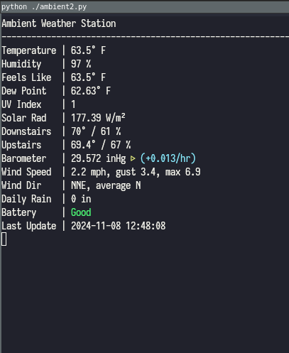

# ambient_weather_curses
Simple app which polls the Ambient Weather API and displays data via ncurses. By simple, I mean it. 

All it does is poll the API periodically, parse the results, and display the data via curses. Wind direction is converted from degrees to cardinal directions, and a rudimentary bit of logic is used to show whether or not the barometer is rising or falling since the last reading. I should probably save a few readings and check the current against the average and will probably add that soon.

I had originally wanted to use Ambient's realtime API but this was simpler, and I leaned heavily (read: _nearly completely_) on chat.openai.com to produce it.   

You'll also notice that I'm not using any of the ambient-specific python packages; this is also by design. OpenAI only knows about the packages up to 2021, so the code it produced was out of date. 

The data updates every 30 seconds. CTRL-C to quit.

* Ambient's API docs: https://ambientweather.docs.apiary.io/#
* My pairs programming partner: https://chat.openai.com

 
